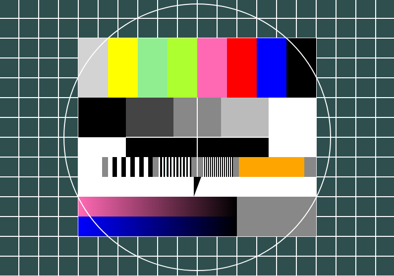

# tvtestcard

This website was created by Stefan Klinkusch at Digital Career Institute in Berlin, Germany using HTML and CSS.

## Features

It features a TV testcard like the one shown in the [German wikipedia](https://de.wikipedia.org/wiki/Datei:FuBK_testcard_vectorized.svg). This was achieved using

- a grid consisting of 14 rows and 20 columns with square elements
- different white, grey, black, and coloured elements (quadratic, rectangular, or triangular) put into the right place with absolute positioning
- a white circle put into the right place using absolute positioning.

## Screenshot

